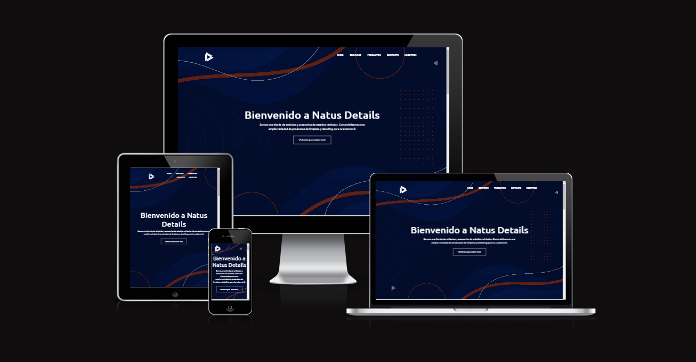

# Proyecto SASS



Este es un proyecto de desarrollo web que utiliza SASS y Bootstrap. El objetivo es crear una página web responsive y dinámica.


## Instalación
Para utilizar este proyecto, primero debes clonar el repositorio en tu máquina local:

```bash
git clone https://github.com/mvazquezmartin/proyecto_SASS.git
```
Luego, debes instalar las dependencias necesarias:
```bash
npm install
```
## Uso
Una vez que hayas clonado el repositorio y hayas instalado las dependencias, puedes ejecutar el proyecto utilizando el siguiente comando:
```bash
npm start
```
Esto iniciará un servidor local en tu máquina y podrás ver la página web en tu navegador.
## Contribuir

Si deseas contribuir a este proyecto, por favor crea un pull request con tus cambios.


## Licencia
Este proyecto está bajo la Licencia [MIT](https://choosealicense.com/licenses/mit/). Para más información, por favor lee el archivo LICENSE.md.      

### 
```
Espero que esto te ayude. Si tienes alguna otra pregunta o necesitas ayuda adicional, no dudes en preguntarme.
